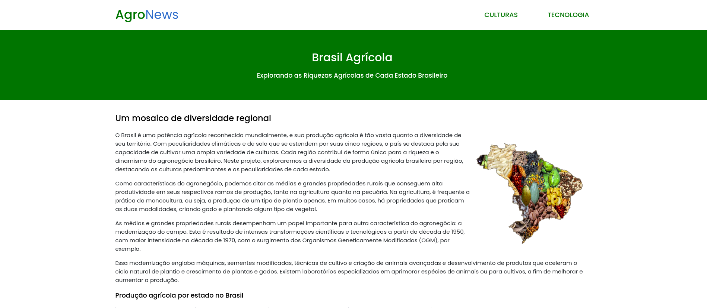
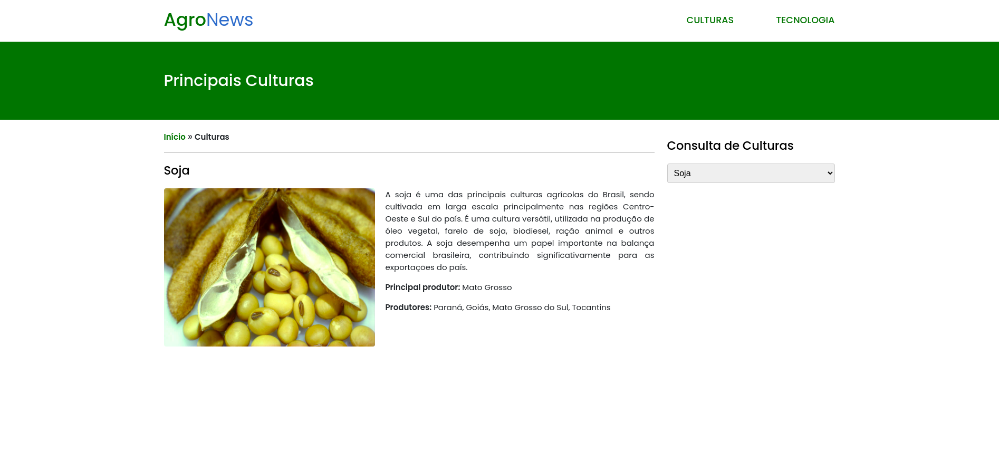
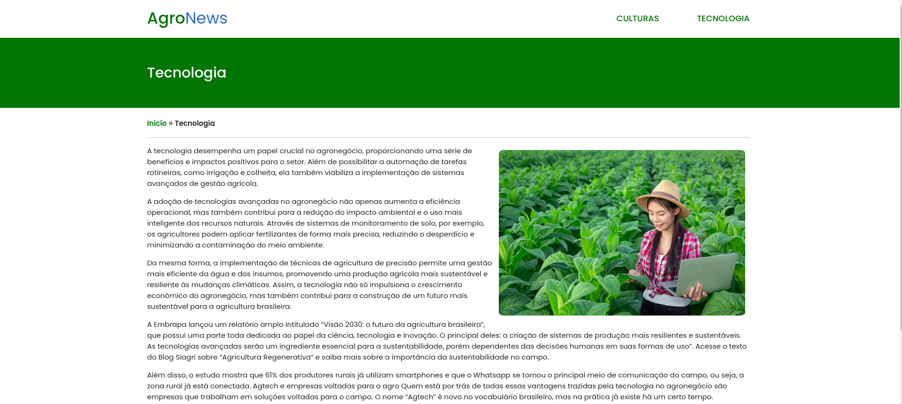

# Projeto Módulo 1

Durante este primeiro módulo, pude aplicar os conhecimentos adquiridos nos seguintes cursos:

- HTML: Formação Básica
- CSS Essential Training
- Responsive Layout
- Learning ECMAScript 6+ (ES6+)

A proposta inicial foi desenvolver um portal de notícias com foco no agronegócio e na influência direta da tecnologia em seu crescimento. Para iniciar, criei três páginas principais: início, culturas e tecnologia.

Utilizei HTML5 para estruturar as páginas, aproveitando ao máximo as principais tags disponíveis. A estilização foi mantida consistente em todas as telas, aplicando vários conceitos do CSS3.

Em relação ao JavaScript, dividi em dois arquivos: scripts.js e culturas.js.

O scripts.js controla o comportamento do menu hamburguer. Já o culturas.js gerencia a listagem de consultas a um arquivo JSON contendo informações sobre as principais culturas no agronegócio brasileiro.

Lembrando que sempre há espaço para melhorias, as quais pretendo abordar nos próximos módulos do curso. 

Cada passo foi devidamente documentado na sequência de commits.

😊
