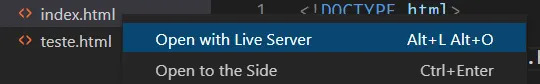

# Projeto Módulo 2

A proposta para o módulo 2 consiste na aplicação dos conhecimentos adquiridos nos cursos ao Projeto 1. Foram implementadas modificações no arquivo culturas.js, onde foram aplicados os conceitos de orientação a objetos aprendidos durante os cursos.

- Fundamentos de Programação: Design Orientado a Objetos
- JavaScript Essential Training
- Curso Completo sobre JavaScript

### Como rodar o projeto ?

Utilize a extensão [LiveServer](https://marketplace.visualstudio.com/items?itemName=ritwickdey.LiveServer) no Visual Studio Code para executar o projeto e evitar problemas de CORS policy.

😊
